# Implementação
A árvore kd foi implementada como uma classe de tal forma que cada nó da árvore é um objeto dessa classe. Os atributos de cada objeto armazanam as seguintes informações: filho da esquerda e filho da direita de um nó, valor da mediana, ponto armazenado por esse nó e profundidade do nó. No caso de um nó interno, o atributo relacionado ao ponto é nulo e se o nó for uma folha os atributos do filho da esquerda e da direita e o valor da mediana são nulos.

A classe da árvore kd também implementa um método para buscar os k pontos armazenados na árvore que estão mais próximos de um dado ponto, que não está na árvore. A árvore é percorrida de forma recursiva (i.e., um nó chama o método de busca do seu filho da direita ou da esquerda). Os nós mais próximos encontrados até o momento são mantidos em uma fila de prioridades que é um atributo da classe. Portanto, seu valor é o mesmo para todos os objetos da classe.

Além disso, foi implementada a classe xNN, que instancia uma árvore kd com um conjunto de pontos de treinamento e classifica pontos em um conjunto de pontos de teste. Essa classe tem um método que compara o classe real dos pontos no conjunto de pontos de testes com o a classe atribuida à esses pontos pelo algoritmo knn e calcula as estatísticas precisão, revocação e acurácia. A fórmula utilizada para calcular essas estatísticas só funciona para problemas de classificação com duas classes apenas.

# Testes com os datasets

Com alguns dos datasets o programa não está lendo todas as linhas do arquivo, mas com outros tudo funciona normalmente. Além disso, ocorreu um erro com o teste utilizando o dataset 5. Eu não consegui entender a causa desses erros.

1

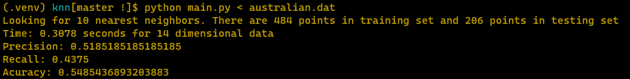

2

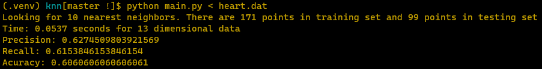

3

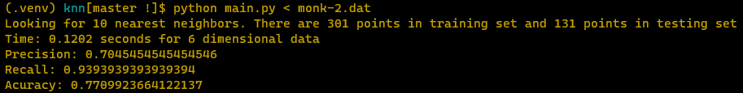

4

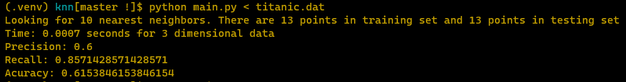

5

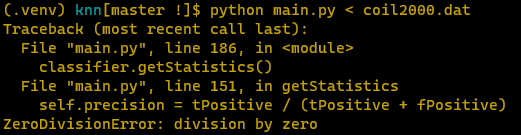

6

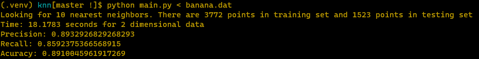
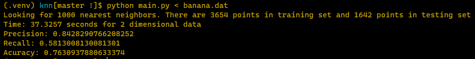

7

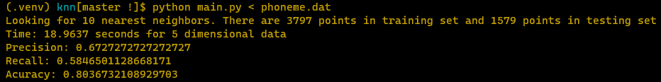
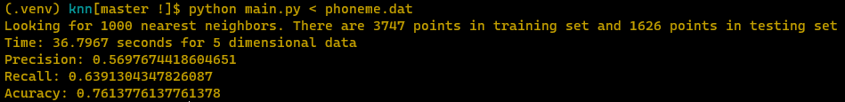

8

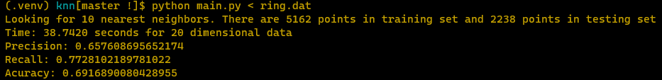
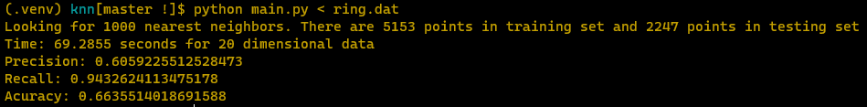

9

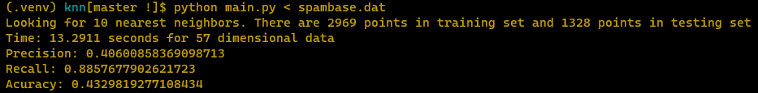

10

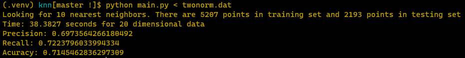
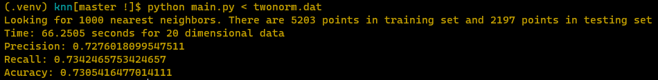
